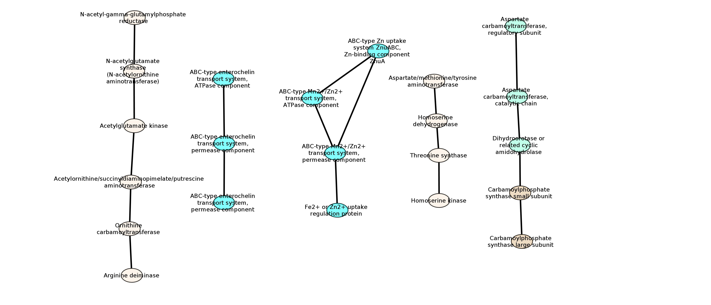

POEM is a pipeline which can predict operons and core operons from metagenomic genome/assembly or short reads. It can be run on most * NIX systems.  

## Requirements


This pipeline is available on Linux systems. Make sure that you have the following installed

1.  [Anaconda](https://www.anaconda.com/ "https://www.anaconda.com/") for Python 2.7
2.  [conda](https://conda.io/en/latest/ "https://conda.io/en/latest/")

    make sure to add path of conda to $PATH environment variable

## Installation

```
$ git clone https://github.com/Rinoahu/POEM

$ cd ./POEM

$ bash ./install.sh
```
The installation script calls conda to install all the necessary python packages and software. 
PS: POEM calls either Prokka or MetaGeneMark for gene predictions. If the users want to use MetaGeneMark, they must install it by themselves, because [MetaGeneMark](http://exon.gatech.edu/GeneMark/ "http://exon.gatech.edu/GeneMark/") requires academic users to agree to an license before downloading. After installtation, make sure to add path of binary executable file [gmhmmp](http://exon.gatech.edu/GeneMark/ "http://exon.gatech.edu/GeneMark/") in [MetaGeneMark](http://exon.gatech.edu/GeneMark/ "http://exon.gatech.edu/GeneMark/") to $PATH environment variable.

## Example


example directory contain a genome fasta file of _E.coli_, run  ```runme.sh``` to test the pipeline
```
$ cd ./example

$ bash ./runme.sh eco.fasta
```


## Usage


For short reads:

    $ bash ./bin/run_poem.sh -f reads.fsa -a y

    reads.fsa is single fasta file. If the reads are paired-end files in fastq or fasta format, 
    use the fq2fa of IDBA_UD to convert them to  a single fasta file.

For genome/assembly:

    $ bash ./bin/run_poem.sh -f genome.fsa -a n

    genome.fsa is the genome/assembly fasta file.


## Output


POEM will create a directory named read.fasta_output to save the results. The results include serveral file:

    1.  input.fsa:
        The contigs or saffolds of IDBA-UD output in fasta format

    2.  input.fsa_gmk_aa.fsa and input.fsa.gff:
        The fasta file of protein sequence and gff file generated by prediction of MetaGeneMark on input.fsa from step 1

    3.  input.fsa.cdhit and input.fsa.cdhit.clstr:
        The cd-hit clustering results of input.fsa_gmk_aa.fsa from step 2

    4.  input.fsa_aa.fsa:
        Filtered input.fsa_gmk_aa.fasta according to the clustering result of step 3

    5.  input.fsa.flt.blast8:
        Blastp results in -m 8 tabular format of input.fsa_aa.fsa from step 4 against COG database

    6.  input.fsa.flt.blast8.flt:
        Filtered blastp output of step 5. The hits with identity < 80% are removed

    7.  input.fsa.cog:
        COG annotations for the protein sequences of step 4. The first row of this tab-delimited file is the gene number. The rest of the file contains 3 columns: col 1 is the gene identifier, chromosome|scaffold name and cluster id split by "$$", col 2 is the COG identifier and col 3 is the functional category of the genes, for example:

            uniq gene 3679
            gene	cog	annot
            CPIBHFJP_04443|Prodigal:2.6|3106475_aa|-|4659209|4659544$$gi|985000614|gb|CP014225.1|$$>Cluster_3671$$*	COG1455	:G::Phosphotransferase system cellobiose-specific component IIC::Carbohydrate transport and metabolism
            CPIBHFJP_04442|Prodigal:2.6|3106198_aa|-|4658880|4659158$$gi|985000614|gb|CP014225.1|$$>Cluster_3846$$*	COG1455	G::Phosphotransferase system cellobiose-specific component IIC::Carbohydrate transport and metabolism
            CPIBHFJP_04441|Prodigal:2.6|3105940_aa|-|4658384|4658734$$gi|985000614|gb|CP014225.1|$$Orphan$$Orphan	COG1447	G::Phosphotransferase system cellobiose-specific component IIA::Carbohydrate transport and metabolism
            ...


    8.  input.fsa.locus:
        This file records the gene's locus on genome. This file contains 5 columns: col 1 is gene identifier and chromosome|scaffold name split by "$$", col2 is the chromosome|scaffold name, col3 is the strand of the gene, col 4 and 5 are the start and end of the gene. For example:

		CPIBHFJP_00001|Prodigal:2.6|772_aa|+|255|857$$gi|985000614|gb|CP014225.1|       gi|985000614|gb|CP014225.1|     +       255     857
		CPIBHFJP_00002|Prodigal:2.6|1014_aa|+|883|1308$$gi|985000614|gb|CP014225.1|     gi|985000614|gb|CP014225.1|     +       883     1308
		CPIBHFJP_00003|Prodigal:2.6|1165_aa|+|1586|1693$$gi|985000614|gb|CP014225.1|    gi|985000614|gb|CP014225.1|     +       1586    1693
		...


    9.  input.fsa.adjacency and input.fsa.operon:
		This file is the predicted operonic adjacent genes. This file contains 11 columns: col 1 is the gene 1's id; col 2 is the chromosome|scaffold id where gene 1 is located; col 3-5 are strand, start and end of gene 1; col 6 is gene 2's id; col 7 is the chromsome|scaffold id where gene 2 is located; col 8-11 are strand, start and end of gene 2. For example:

			CPIBHFJP_00001|Prodigal:2.6|772_aa|+|255|857$$gi|985000614|gb|CP014225.1|       gi|985000614|gb|CP014225.1|     +       255     857     CPIBHFJP_00002|Prodigal:2.6|1014_aa|+|883|1308$$gi|985000614|gb|CP014225.1|     gi|985000614|gb|CP014225.1|     +       883     1308    False
			CPIBHFJP_00002|Prodigal:2.6|1014_aa|+|883|1308$$gi|985000614|gb|CP014225.1|     gi|985000614|gb|CP014225.1|     +       883     1308    CPIBHFJP_00003|Prodigal:2.6|1165_aa|+|1586|1693$$gi|985000614|gb|CP014225.1|    gi|985000614|gb|CP014225.1|     +       1586    1693    False
			...


    10.  input.fsa.operon:
		The predicted full operons. This file contains 3 columns: col 1 is the ids of operonic genes split by --> or <--, arrow stands for the strand of gene; col 2 is the COG ids of the operonic genes; col 3 is the COG annotation of the operonics genes split by --> or <--. For example:
			
			gene_id COG_id  annotation
			CPIBHFJP_00007|Prodigal:2.6|2673_aa|+|3821|3946$$gi|985000614|gb|CP014225.1|-->CPIBHFJP_00008|Prodigal:2.6|2862_aa|+|3961|4182$$gi|985000614|gb|CP014225.1|-->CPIBHFJP_00009|Prodigal:2.6|3078_aa|+|4218|4484$$gi|985000614|gb|CP014225.1|-->CPIBHFJP_00010|Prodigal:2.6|3373_aa|+|4484|4867$$gi|985000614|gb|CP014225.1|-->CPIBHFJP_00011|Prodigal:2.6|3449_aa|+|4887|5078$$gi|985000614|gb|CP014225.1|        unknown-->unknown-->unknown-->COG3001-->COG3001 unknown::unknown-->unknown::unknown-->unknown::unknown-->G::Fructosamine-3-kinase::Carbohydrate transport and metabolism-->G::Fructosamine-3-kinase::Carbohydrate transport and metabolism
			CPIBHFJP_00036|Prodigal:2.6|20592_aa|+|29823|30533$$gi|985000614|gb|CP014225.1|-->CPIBHFJP_00037|Prodigal:2.6|21036_aa|+|30538|31215$$gi|985000614|gb|CP014225.1|-->CPIBHFJP_00038|Prodigal:2.6|21527_aa|+|31230|31937$$gi|985000614|gb|CP014225.1|-->CPIBHFJP_00039|Prodigal:2.6|21840_aa|+|31937|32485$$gi|985000614|gb|CP014225.1|-->CPIBHFJP_00040|Prodigal:2.6|22830_aa|+|32495|33661$$gi|985000614|gb|CP014225.1|-->CPIBHFJP_00041|Prodigal:2.6|23958_aa|+|33634|35169$$gi|985000614|gb|CP014225.1|-->CPIBHFJP_00042|Prodigal:2.6|24099_aa|+|35169|35822$$gi|985000614|gb|CP014225.1|-->CPIBHFJP_00043|Prodigal:2.6|25233_aa|+|35889|37196$$gi|985000614|gb|CP014225.1|   COG0398-->unknown-->COG0398-->COG2128-->COG4134-->COG4135-->COG4136-->COG2897   S::Uncharacterized membrane protein YdjX, TVP38/TMEM64 family, SNARE-associated domain::Function unknown-->unknown::unknown-->S::Uncharacterized membrane protein YdjX, TVP38/TMEM64 family, SNARE-associated domain::Function unknown-->P::Alkylhydroperoxidase family enzyme, contains CxxC motif::Inorganic ion transport and metabolism-->R::ABC-type uncharacterized transport system YnjBCD, periplasmic component::General function prediction only-->R::ABC-type uncharacterized transport system YnjBCD, permease component::General function prediction only-->R::ABC-type uncharacterized transport system YnjBCD, ATPase component::General function prediction only-->P::3-mercaptopyruvate sulfurtransferase SseA, contains two rhodanese domains::Inorganic ion transport and metabolism


    11. input.fsa.cog_adjacency:
        This file contain two parts: The first part converts operonic adjacency to COG id adjacency and statistic of the COG id adjacency. The second part evaluate the core operon and its closest real operon.

			##############################
			# COG adjacency
			##############################
			geneA geneB cA cB cAB cA+cB-cAB cAB/(cA+cB-cAB)
			COG3188 COG3539 11 32 7 36 0.194444444444
			COG2801 COG2963 16 16 11 21 0.52380952381
			COG1662 COG3677 10 9 8 11 0.727272727273
			...

			##############################
			# evalute the core operon
			##############################
			predict_operon  real_operon_name        real_operon_cog Precise Recall  F1      predict_annot   real_annot
			COG0601$$COG1173        sso:SSO3058$$sso:SSO3059        COG0601$$COG1173        1.000000        1.000000        1.000000        ABC-type dipeptide/oligopeptide/nickel transport system, permease component$$ABC-type dipeptide/oligopeptide/nickel transport system, permease component        ABC-type dipeptide/oligopeptide/nickel transport system, permease component$$ABC-type dipeptide/oligopeptide/nickel transport system, permease component
		COG1129$$COG1172        eco:b1513$$eco:b1514$$eco:b1515$$eco:b1516$$eco:b1517$$eco:b1518$$eco:b1519     COG1129$$COG1172$$COG1172$$COG1879$$COG1830$$COG1359$$COG4106   1.000000        0.428571        0.600000        ABC-type sugar transport system, ATPase component$$Ribose/xylose/arabinose/galactoside ABC-type transport system, permease component    ABC-type sugar transport system, ATPase component$$Ribose/xylose/arabinose/galactoside ABC-type transport system, permease component$$Ribose/xylose/arabinose/galactoside ABC-type transport system, permease component$$ABC-type sugar transport system, periplasmic component, contains N-terminal xre family HTH domain$$Fructose-bisphosphate aldolase class Ia, DhnA family$$Quinol monooxygenase YgiN$$Trans-aconitate methyltransferase
			...


    12. input.fsa.core_cog_adjacency:
        The core COG adjacency is the same as the first part of file from step 11. This file is tab delimited.

			geneA   geneB   cA      cB      cAB     cA+cB-cAB       cAB/(cA+cB-cAB)
			COG1173 COG0601 5       5       5       5       1.0
			COG1172 COG1129 8       8       6       10      0.6
			COG2963 COG2801 16      16      11      21      0.52380952381
			COG1662 COG3677 10      9       8       11      0.727272727273


    13. input.fsa.core_network.sif, input.fsa.core_node.tab:
        Network, node attribute and edge attribute extracted from step 11 for cytoscape visualization. Figure 1 shows an example to view the core operons by cytoscape.



*Figure 1: visualization of core operons in cytoscape*


